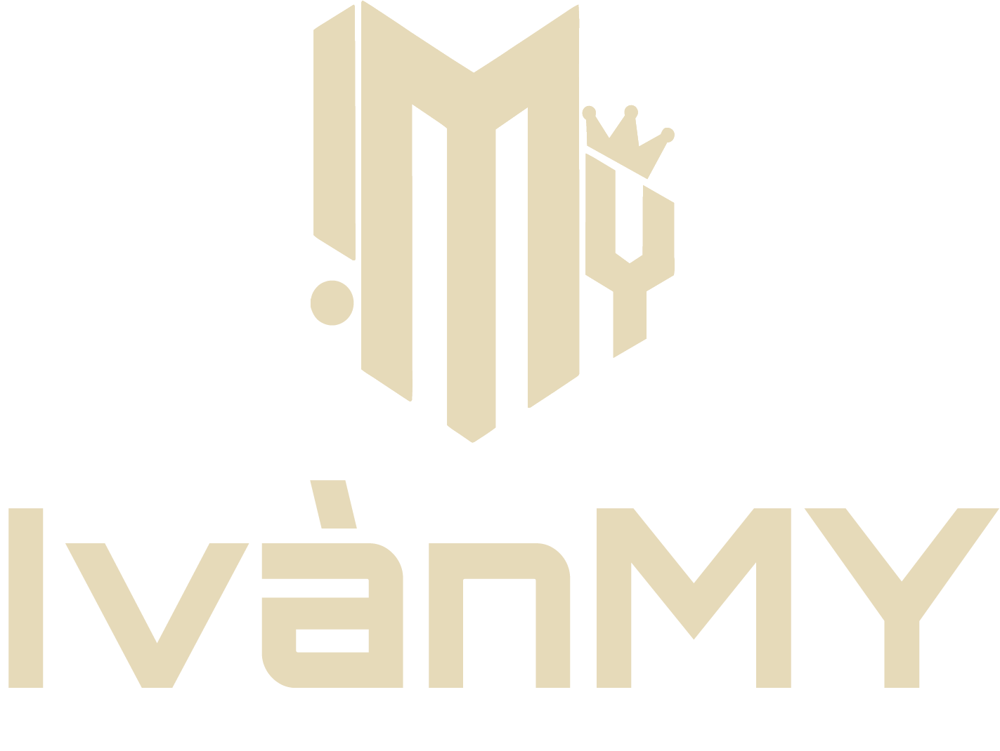
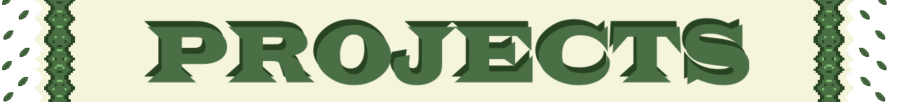
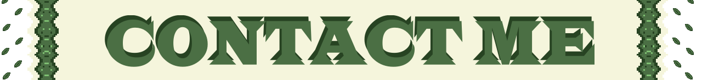

  

$$\color{#4B6F44}{\text{-Chilean indie game dev-}}$$

  

  
  
  
  
  

  
  
  

  
  
  

  <!-- Tarjeta de Rachas grande -->
  
    
  <!-- Tarjeta de Detalles grande y alineada -->
  

  

  

 

### $$\color{#4B6F44}{\text{ORINN}}$$
$$\color{#dadaa1}{\text{RPG • Metroidvania • Platformer • Unity}}$$

**Status:** In development
 **Role:** Solo Developer, Lead Programmer, Game Design, UI/UX, Project Creator & Concept

 

🔒 Private Repository

 

#

 

### $$\color{#4B6F44}{\text{PIXELFEST}}$$
$$\color{#dadaa1}{\text{Rhythm • Arcade • Microgames • Unity}}$$

**Status:** In development
 **Role:** Solo Developer, Lead Programmer, Game Design, UI/UX, Technical Artist, Project Creator & Concept

 

🔒 Private Repository

 

#

 

### $$\color{#4B6F44}{\text{32 SEGUNDOS}}$$
$$\color{#dadaa1}{\text{Puzzle • Culture • Microgames • Unity}}$$

**Status:** In development
 **Role:** Gameplay & UI Programmer
 *Developed for Abstract Chile Game Jam 2025 — Ranked #7 Overall (Top 2# Presentation & Theme)*

 

🔒 Private Repository

 

#

 

### $$\color{#4B6F44}{\text{SHOOT THE BEAT}}$$
$$\color{#dadaa1}{\text{Action • Minimalist • Shooter • Unity}}$$

**Status:** Concluded
 **Role:** Gameplay & UI Programmer, Game Designer, UI/UX
 *Developed for Santo Tomás Second Game Jam — Won 2nd Place 🏆*

 

🔓 Public Repository

 

#

 

### $$\color{#4B6F44}{\text{THE JOURNEY OF MIGAS}}$$
$$\color{#dadaa1}{\text{Platformer • Action • Comedy • Construct 3}}$$

**Status:** Concluded
 **Role:** Lead Programmer, Game Designer, UI/UX
 *Developed for Santo Tomás First Game Jam — Won 2nd Place 🏆*

 

❌ No Repository Available

 

#

 

### $$\color{#4B6F44}{\text{GENQR}}$$
$$\color{#dadaa1}{\text{Web Utility • JavaScript • Python}}$$

**Status:** Completed (v2.0)
 **Role:** Solo Developer, Software Architect, UI Designer
 Create custom QR codes with gradients, logos, and animated GIFs. 100% private, secure, and client-side

 

🔓 Public Repository

 

#

 

### $$\color{#4B6F44}{\text{ENTRELÍNEAS}}$$
$$\color{#dadaa1}{\text{2D Narrative • Interactive Experience • Unity}}$$

**Status:** Completed (Post-Release Devlog in Progress)
 Personal narrative project with atmospheric visuals and hidden-message mechanics
 **Role:** Solo Developer, Lead Programmer, Game Design, UI/UX, Technical Artist, Project Creator & Concept

 

🔒 Private Repository

*Soon to be published on Itch.io alongside an upcoming development log*

 

#

 

### $$\color{#4B6F44}{\text{GENETRACE}}$$
$$\color{#dadaa1}{\text{Action • VR • Wave Shooter • Unity}}$$

**Status:** Prototype Concluded
 Developed in Oculus Meta Quest 3S
 **Role:** Solo Developer, Lead Programmer, Game Designer, UI/UX, Project Creator & Concept

 

🔓 Public Repository

 

#

 

### $$\color{#4B6F44}{\text{LIGNUM}}$$
$$\color{#dadaa1}{\text{Mobile App • Firebase • C++ • Flutter}}$$

**Status:** In Progress (On Hold)
 **Role:** Solo Developer, Lead Programmer, UI Designer
 A personalized mobile application designed for couples, featuring sync mechanics and custom interfaces

 

🔒 Private Repository

 

  

  

   
  
  
  

  
